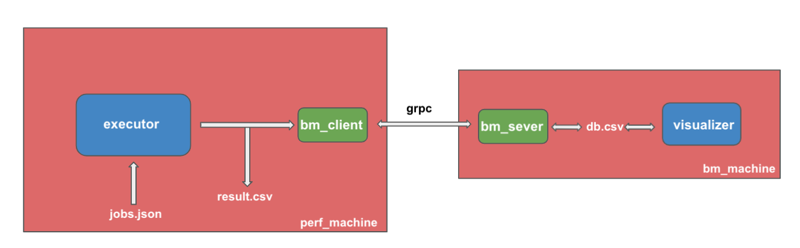

# dl-infer-perf
A perf analysis of deep learning inference performance over pytorch/tensorflow and TensorRT/XLA/TVM.

## Environments
### TVM
docker: nvidia/cuda:11.1.1-devel-ubuntu18.0

compile tvm with llvm (clang+llvm-11.0.1-x86_64-linux-gnu-ubuntu-16.04)

### XLA
docker: nvcr.io/nvidia/tensorflow:20.07-tf2-py3

### TensorRT
docker: nvcr.io/nvidia/tensorrt:19.09-py3 

## Candidates
model
- vgg
- mobilenet
- resnet50
- inception

optimizer
- TVM
- XLA
- TensorRT

front-end(dl framework)
- ONNX
- Pytorch
- Tensorflow

|               | Onnx          | Pytorch       | Tensorflow | 
| ------------- |:-------------:| -------------:|-------------:|
| baseline      | ✅           | ✅           | ✅      |      
| tvm           | [#4](/../../issues/4)  |    ✅ 1.4           | ✅ 1.12        |
| XLA      |   -  |  - | ✅ |
| TensorRT |   [#5](/../../issues/5)   | -      |  ✅ |

## Usage
### Run per optimizer&frontend
```bash
usage: python3 infer_perf/<script.py> <model_name> <options>

i.e. run tf resnet50 with xla enabled
python3 infer_perf/to_xla resnet50 --xla
```
### Run varios jobs together
```bash
usage: python3 executor <job.json> --report <outout.csv>

i.e.
python executor torch2tvm.json  --report result.csv
```


### Run with benchmark server
```
usage: python3 executor <job.json> --server <bm_server>
```



## Code Format
yapf infer_perf/*.py -i --style yapf.style 
