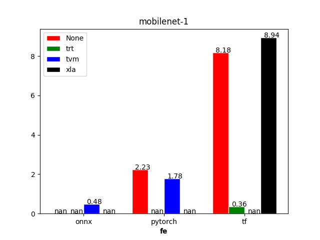
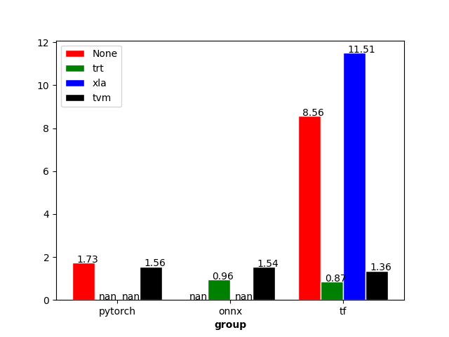
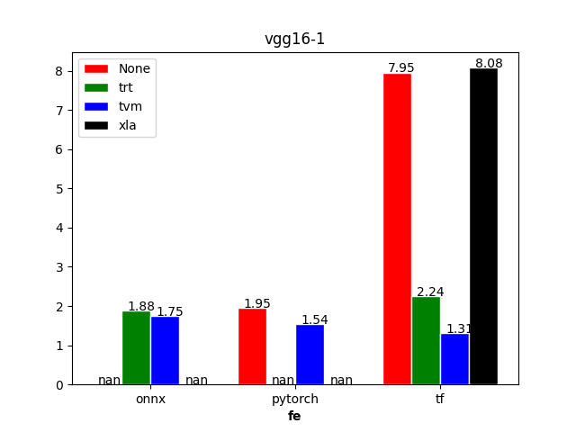
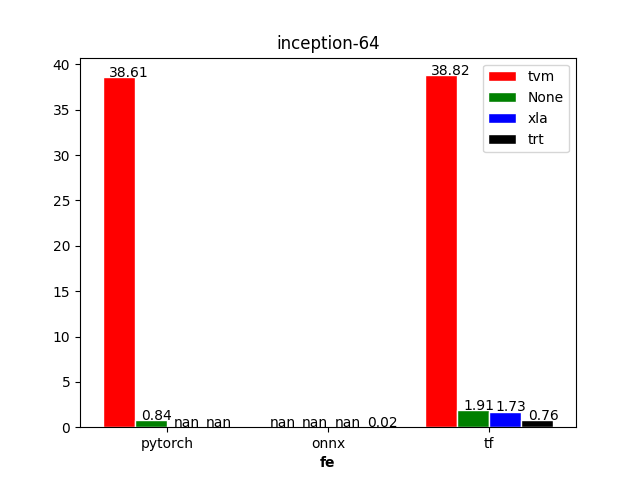
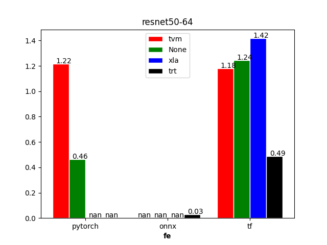
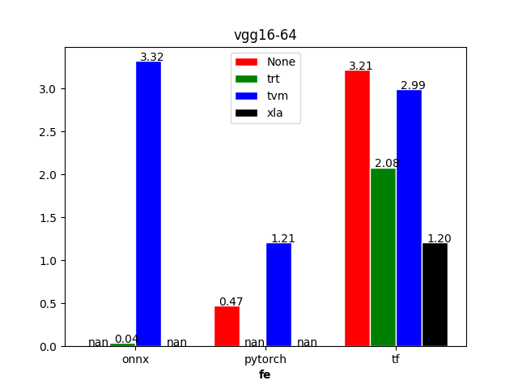

# Device
```bash
+-----------------------------------------------------------------------------+
| NVIDIA-SMI 460.32.03    Driver Version: 460.32.03    CUDA Version: 11.2     |
|-------------------------------+----------------------+----------------------+
| GPU  Name        Persistence-M| Bus-Id        Disp.A | Volatile Uncorr. ECC |
| Fan  Temp  Perf  Pwr:Usage/Cap|         Memory-Usage | GPU-Util  Compute M. |
|                               |                      |               MIG M. |
|===============================+======================+======================|
|   0  Tesla T4            On   | 00000000:00:09.0 Off |                    0 |
| N/A   37C    P8    10W /  70W |      0MiB / 15109MiB |      0%      Default |
|                               |                      |                  N/A |
+-------------------------------+----------------------+----------------------+

+-----------------------------------------------------------------------------+
| Processes:                                                                  |
|  GPU   GI   CI        PID   Type   Process name                  GPU Memory |
|        ID   ID                                                   Usage      |
|=============================================================================|
|  No running processes found                                                 |
+-----------------------------------------------------------------------------+
```
# Version
## TVM
```bash
tvm: 0.8.dev0
clang+llvm: clang+llvm-11.0.1-x86_64-linux-gnu-ubuntu-16.04
cuda: 11.1.1
torch==1.7.0
tensorflow==1.12.0
onnx==1.8.1
```
## XLA
```
cuda: 11.0 
tensorflow==2.2.0
```
## TRT
```
cuda: 10.1
nvidia-tensorrt==7.2.2.3
tensorflow==2.1.0
```
# Reuslt
**device=gpu, batch-size=1**








**device=gpu, batch-size=64**






